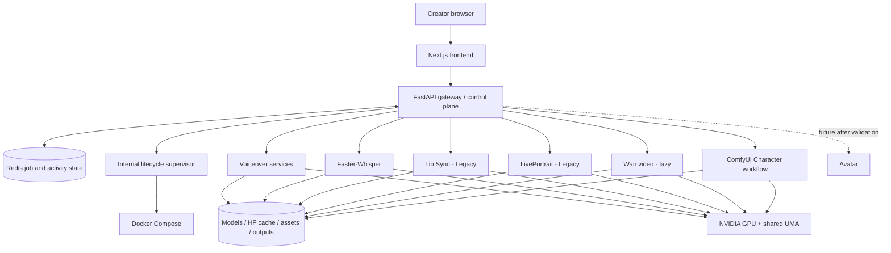

# Architecture

NeonForge is a single-host, local-first media studio for DGX Spark. This modernization pass keeps the existing Next.js, FastAPI, Redis, Docker Compose, model-service, and ComfyUI boundaries intact.

## Request and lifecycle flow

1. The browser loads the workflow-first Next.js UI and sends API requests through its gateway rewrites.
2. The FastAPI gateway validates inputs, checks shared-memory admission, creates job/history state, and calls the relevant model service.
3. Redis stores job and activity state where the existing implementation requires it.
4. For managed lazy services, the gateway asks the internal supervisor to use Docker Compose. The gateway does not mount the Docker socket.
5. Model services read shared weights/cache and write shared outputs. The browser receives progress and result URLs through the gateway.

## Product surfaces

| Surface | Backend path | Lifecycle |
| --- | --- | --- |
| Voiceover | Gateway `voiceover/` subsystem → F5/Fish/Miso/Breeze/Vox | F5 baseline; additional engines optional/profile-gated; model-level lazy loading where supported |
| Video Generation | Gateway → Wan 2.1 service | `wan21` profile, supervisor-managed, singleton, lazy load/unload |
| Character | Gateway managed template → ComfyUI | `comfyui` profile; heavyweight and memory-gated |
| Avatar | No backend until LongCat or another candidate passes DGX validation | UI reports Disabled |
| Lip Sync | Gateway → video-retalking adapter | `legacy` profile; preflight-gated |
| Utilities & Status | Gateway memory/service/model inspection | Always available with the control plane |
| Transcription | Gateway → Faster-Whisper | Baseline service |

LivePortrait, the earlier F5 workflow surface, and ReActor are preserved inside Character's collapsed Legacy/experimental tools. They are not primary navigation destinations.

## Services

| Service | Repository path | Responsibility |
| --- | --- | --- |
| Frontend | `frontend/` | Next.js 16 UI, API rewrites, local workflow state |
| Gateway | `gateway/` | FastAPI control plane, validation, memory gates, jobs, history, uploads, Voiceover, ComfyUI template patching |
| Supervisor | `supervisor/` | Internal-only Compose lifecycle operations; sole Docker-socket holder |
| Redis | Compose image | Job/activity state and readiness dependency |
| Whisper | `services/whisper/` | Speech-to-text |
| F5-TTS | `services/f5tts/` | Default/reliability-first voice synthesis |
| Fish Speech | Prebuilt local image | Optional higher-quality voice synthesis |
| MisoTTS | `services/misotts/` | Optional prompt-conditioned voice synthesis |
| Breeze TTS 2 | `services/breeze_tts/` | Optional voice design/clone/direction |
| VoxCPM2 | `services/voxcpm2/` | Experimental design/clone/continuation |
| Lip Sync | `services/lipsync/` | Legacy subprocess adapter with strict runtime/model preflight |
| LivePortrait | `services/liveportrait/` | Legacy portrait adapter with strict import/model preflight |
| Wan 2.1 | `services/wan21/` | On-demand text-to-video |
| ComfyUI | `comfyUI/` | Managed Wan2.2 Character graph execution |

The untracked `Wan2.2-Animate/` checkout is a separate cloud/API-backed Gradio experiment. It is isolated behind `cloud-experimental` and is not the supported Character implementation.

## Storage and network

| Host path | Container path | Use |
| --- | --- | --- |
| `/srv/ai/models` | `/models` | Explicit model checkpoints |
| `/srv/ai/cache/hf` | `/cache/hf` | Shared Hugging Face cache |
| `/srv/ai/outputs` | `/outputs` | Generated media, history data, ComfyUI I/O |
| `/srv/ai/assets` | `/app/data/assets` | Uploaded reusable assets and voice profiles |
| `/srv/ai/logs` | `/logs` | Service logs |

All services communicate over the `ai-net` bridge. The frontend and gateway bind to loopback by default. Redis also remains loopback-only; ComfyUI exposes a host port only when its profile is enabled.

## Resource safety

DGX Spark CPU and GPU allocations share unified memory. Admission uses `/proc/meminfo`, not discrete-VRAM fields. The default reserve is 40 GB for heavy Wan/ComfyUI work, 10 GB for medium services, and 2 GB for light work. Model services retain their existing idle teardown where implemented; optional containers are profile-gated so a base launch does not keep every model resident.

This is intentionally a small control plane, not a scheduler or plugin framework.
