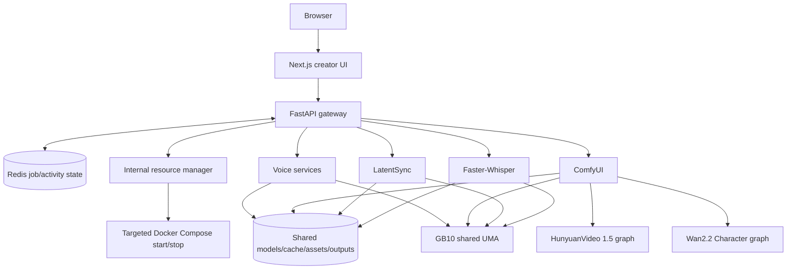
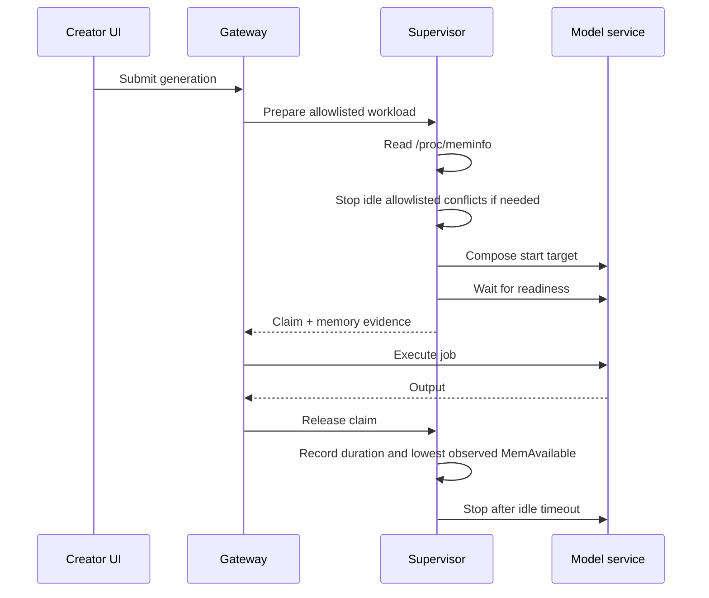

# Architecture

NeonForge is a single-host media studio for DGX Spark. It deliberately uses the existing Next.js, FastAPI, Redis, Docker Compose, and model-service boundaries rather than a general scheduler.

## Workload sequence

The gateway does not have the Docker socket. The supervisor is internal-only and accepts service identifiers from an immutable policy. Its protected set is frontend, gateway, Redis, supervisor, and Whisper. Candidate selection intersects running containers with the allowlist, excludes the requested and claimed services, then tries the largest measured consumers first. No arbitrary kill or host-process path exists.

## Product-to-backend map

| Primary surface | Backend | Lifecycle |
| --- | --- | --- |
| Voiceover | F5/Fish/Miso/Breeze/VoxCPM2 | Voice policies, normally 15-minute warm window |
| Video Generation | HunyuanVideo 1.5 managed ComfyUI template | 40 GiB cold-start floor, 5-minute warm window |
| Character | Wan2.2 Animate managed ComfyUI template | 48 GiB cold-start floor, 5-minute warm window |
| Avatar | EchoMimicV3-Flash target | Disabled until ARM64 real render passes |
| Lip Sync | LatentSync 1.6 service | 32 GiB cold-start floor, 5-minute warm window |
| Utilities & Status | Gateway and supervisor inspection | Always-on control plane |

ComfyUI is intentionally shared by the two managed graph workflows. The supervisor applies an explicit workflow-id-to-memory-minimum map, while the gateway supplies only the allowlisted workflow identity and display label.

## Storage

| Host path | Container path | Purpose |
| --- | --- | --- |
| `/srv/ai/models` | `/models` | Explicit checkpoints |
| `/srv/ai/cache/hf` | `/cache/hf` | Shared Hugging Face cache |
| `/srv/ai/outputs` | `/outputs` | Generated media, ComfyUI I/O, history database |
| `/srv/ai/assets` | `/app/data/assets` | Reusable uploads and voice profiles |
| `/srv/ai/logs` | `/logs` | Service logs |

## Failure behavior

- If allowlisted reclamation cannot reach the minimum, the request fails with the required/current memory, what was stopped, and active claims.
- If a model service never becomes ready, the claim is cleaned up and the failure is recorded.
- ComfyUI uses `restart: "no"`; OOM is not hidden by a silent container restart.
- Completed Comfy prompts receive a bounded history-publication grace to avoid queue/history races.
- Service wrappers expose liveness separately from model/readiness state.

This is a small single-machine control plane, not Kubernetes, a DAG engine, a plugin system, or a universal GPU scheduler.
