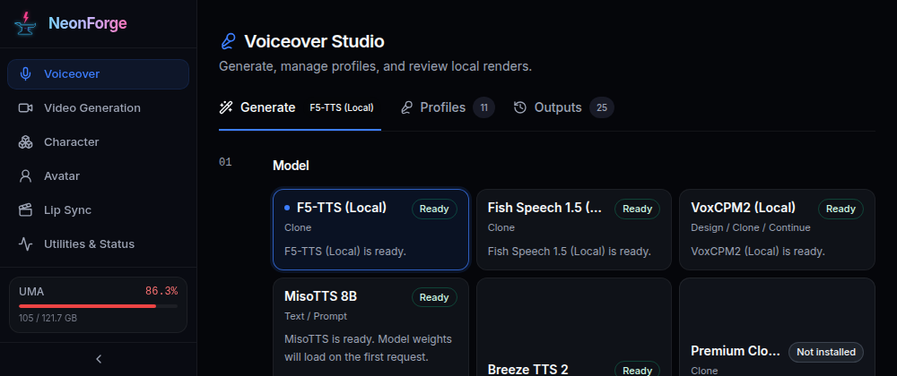
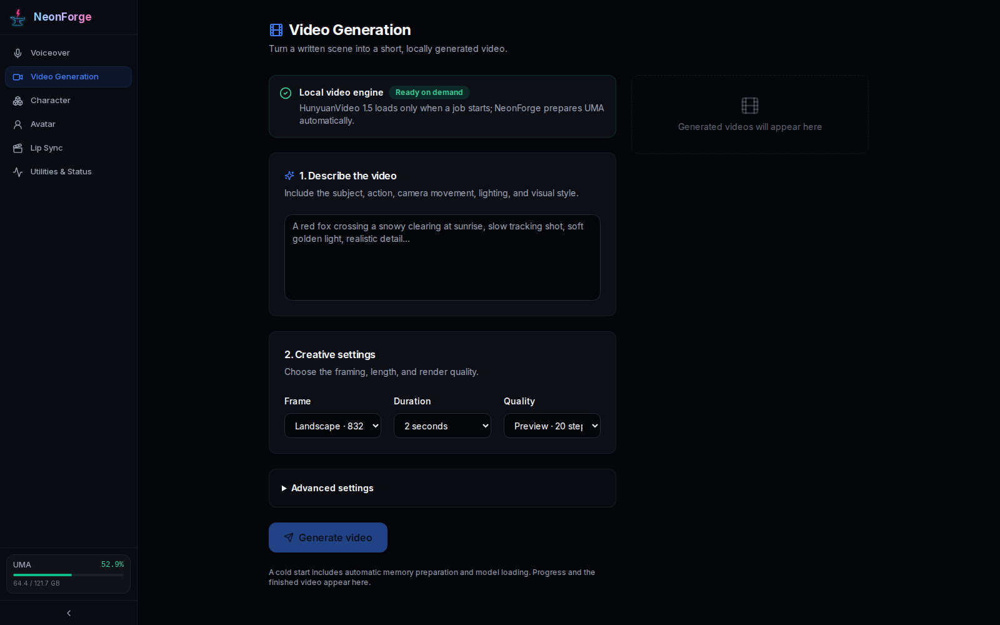
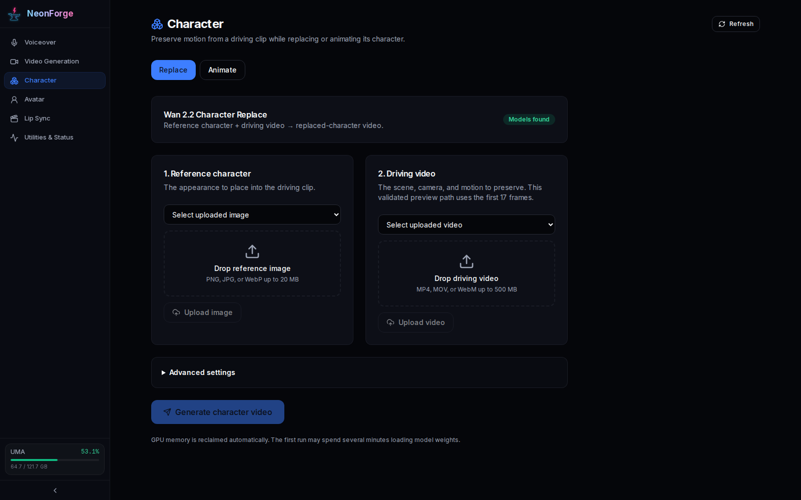
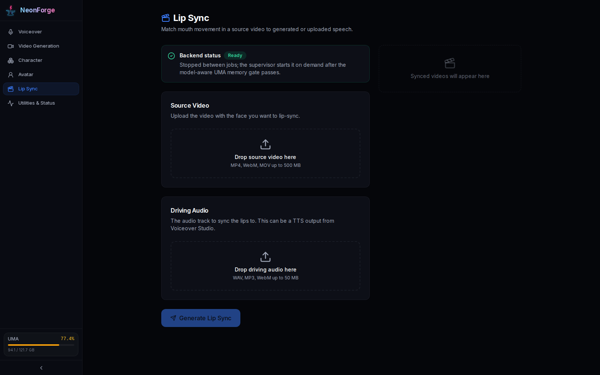
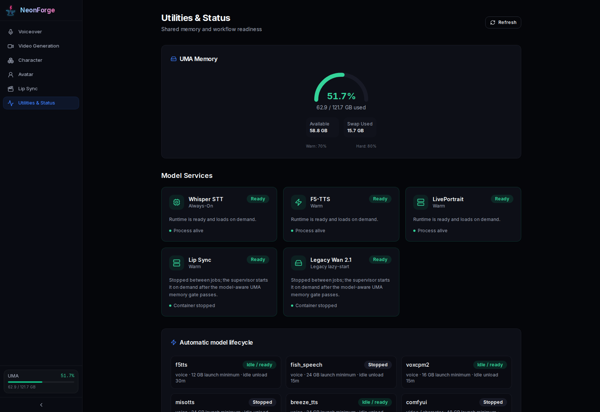
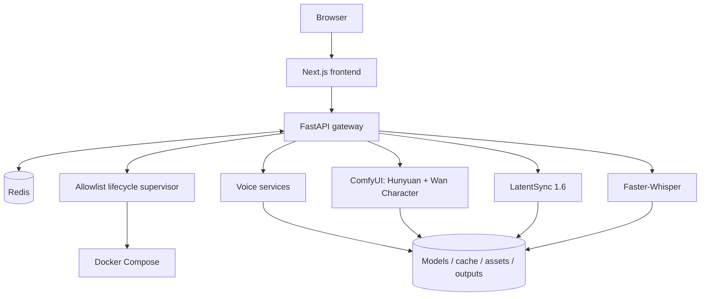

# NeonForge

Local-first voice and video creation for NVIDIA DGX Spark. NeonForge combines a focused Next.js studio with a FastAPI gateway, Redis, model-specific services, managed ComfyUI workflows, and an allowlist-only workload supervisor.

[](https://github.com/AlirezaAlampour/neonforge/actions/workflows/ci.yml)




The primary application has exactly six creator destinations: **Voiceover**, **Video Generation**, **Character**, **Avatar**, **Lip Sync**, and **Utilities & Status**. Older `/studio`, `/broll`, and `/voice` routes remain reachable for compatibility but are not primary navigation.

## Current workflow status

“Validated” means a real generation completed on the current 128 GB DGX Spark, not merely that a health endpoint responded.

| Workflow | Selected backend | DGX result |
| --- | --- | --- |
| Voiceover | F5-TTS plus optional Fish, Miso, Breeze, and VoxCPM2 | Existing workflow preserved; real MisoTTS regression render passed |
| Video Generation | HunyuanVideo 1.5, 480p CFG-distilled FP8 | **Validated:** 512×288, 17-frame H.264 render |
| Character Replace | Wan2.2 Animate 14B managed ComfyUI graph | **Validated:** 1280×720, 17-frame H.264 render |
| Character Animate | Wan2.2 Animate | Disabled until its distinct graph is validated |
| Lip Sync | LatentSync 1.6 | **Validated:** 1080×1920, 2.08-second H.264/AAC render |
| Avatar | EchoMimicV3-Flash | Selected, not integrated; upstream ARM64 dependency set is not reproducible yet |

## Automatic UMA lifecycle

NeonForge automatically unloads conflicting local inference runtimes as needed. Users normally do not need to manage GPU/UMA memory manually.

For each managed job, the gateway asks the supervisor to:

1. read `MemAvailable` from `/proc/meminfo`;
2. reclaim only idle, explicitly allowlisted NeonForge model services;
3. wait for memory to return;
4. start and verify the requested backend;
5. hold a workload claim during generation;
6. log observed memory and duration; and
7. stop the backend after a configurable idle period.

The supervisor can manage F5-TTS, Fish Speech, VoxCPM2, MisoTTS, Breeze TTS, ComfyUI, LatentSync, legacy LivePortrait, legacy Wan 2.1, and the experimental Wan UI. It never stops the gateway, frontend, Redis, supervisor, Whisper, arbitrary processes, or unrelated containers.

Measured acceptance runs:

| Backend | Available before | Lowest observed | Duration | Idle result |
| --- | ---: | ---: | ---: | --- |
| Wan2.2 Character | 58.1 GiB | 3.8 GiB | 233.4 s | ComfyUI stopped; 43.0 GiB recovered |
| LatentSync 1.6 | 59.8 GiB | 40.0 GiB | 111.0 s | Service stopped after 300 s |
| HunyuanVideo 1.5 cold run | 58.8 GiB | 26.7 GiB | 168.4 s | ComfyUI released for idle cleanup |
| MisoTTS voiceover | 57.2 GiB | 26.6 GiB | 110.6 s | Claim released; model retained for configured voice warm window |

The final deployed reclamation check began with 27.3 GiB available, stopped only idle MisoTTS, recovered to 57.8 GiB, started ComfyUI for the 40 GiB Hunyuan policy, and released the claim successfully. The five-minute idle sweep then stopped ComfyUI and recovered its remaining 1.1 GiB wrapper footprint. Protected and unrelated services were untouched.

The Character acceptance run also found an unsafe longer-input case that reached the host OOM killer. ComfyUI now uses `restart: "no"`, stale jobs fail visibly, the launch floor is 48 GiB, and the validated Character preview path is capped at 17 input frames.

## Deployed workflow screenshots

| Video Generation | Character Replace |
| --- | --- |
|  |  |

| Lip Sync | Utilities & Status |
| --- | --- |
|  |  |

## Architecture



The gateway has no Docker socket. Only the internal supervisor can perform targeted Compose lifecycle operations. See [ARCHITECTURE.md](ARCHITECTURE.md).

## Quick start

Requirements: DGX Spark or compatible NVIDIA Linux/ARM64 host, NVIDIA Container Toolkit, Docker Compose v2, Git, and sufficient storage under `/srv/ai`.

```bash
git clone https://github.com/AlirezaAlampour/neonforge.git
cd neonforge
cp .env.example .env

sudo install -d -o "$USER" -g "$USER" \
  /srv/ai/models /srv/ai/cache/hf /srv/ai/outputs /srv/ai/assets /srv/ai/logs

docker compose config --quiet
docker compose up -d
curl --fail http://127.0.0.1:8080/readyz
curl --fail http://127.0.0.1:3000/
```

The default bindings are loopback-only. Set `BIND_ADDRESS` to a specific trusted LAN or Tailscale address when remote access is intended.

Heavy backends are profile-gated and normally started by the supervisor when a creator submits a job. Model provisioning details, hashes, sizes, and license boundaries are in [docs/models.md](docs/models.md).

## Important API endpoints

| Method | Path | Purpose |
| --- | --- | --- |
| `GET` | `/readyz` | Gateway and Redis readiness |
| `GET` | `/memory` | Current UMA and workload launch minimums |
| `GET` | `/services/status` | Normalized creator-facing service state |
| `GET` | `/workloads/status` | Claims, managed services, events, and lifecycle metrics |
| `POST` | `/api/v1/voiceover/jobs` | Long-form voiceover |
| `POST` | `/api/v1/lipsync/sync` | On-demand LatentSync job |
| `POST` | `/api/v1/comfyui/jobs` | Managed Video Generation or Character job |

## Development

Python package management is uv-only:

```bash
uv lock --check
uv sync --locked --dev
uv run pytest
```

Frontend:

```bash
cd frontend
npm ci --ignore-scripts
npm run lint
npm run build
```

## Documentation

- [Current audited state](CURRENT_STATE.md)
- [Models, research, and licenses](docs/models.md)
- [Installation](docs/installation.md)
- [Architecture](ARCHITECTURE.md)
- [Troubleshooting](docs/troubleshooting.md)
- [Voiceover Studio](VOICEOVER_STUDIO.md)
- [Changelog](CHANGELOG.md)

## License boundary

No NeonForge source license has been granted in this repository; absent a license, redistribution rights are not implied. Third-party code, checkpoints, voices, reference media, and outputs retain their own terms. Review [docs/models.md](docs/models.md) before commercial use.
