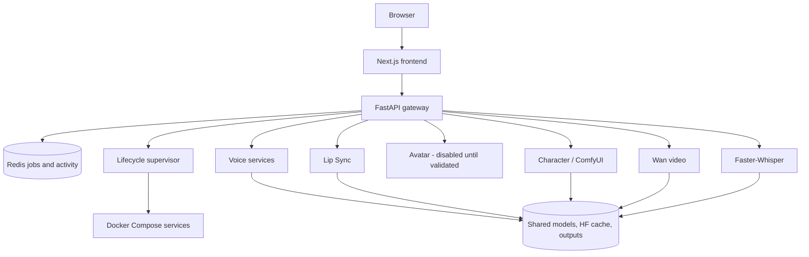

# NeonForge

Local-first voice and video creation for NVIDIA DGX Spark: a focused Next.js studio backed by FastAPI, Redis, model-specific services, and managed ComfyUI workflows.

[](https://github.com/AlirezaAlampour/neonforge/actions/workflows/ci.yml)


NeonForge is designed around creator goals, not a catalog of every local model. Voiceover Studio is the most polished surface; video, character, avatar, lip-sync, transcription, and system tools remain deliberately scoped and report when their runtimes are not ready.

## Features

- **Voiceover** — reusable voice profiles, long-form chunking, job recovery, and immediate audio review.
- **Video Generation** — gateway-managed Wan jobs with shared-memory admission control.
- **Character** — Wan2.2 Animate replacement through a validated ComfyUI template.
- **Avatar** — reserved product workflow; LongCat-Video-Avatar 1.5 is not exposed until it passes real DGX Spark validation.
- **Lip Sync** — source video plus audio, with honest backend readiness and the existing implementation retained as legacy.
- **Utilities & Status** — shared UMA pressure and creator-facing service states: Ready, Loading, Disabled, Missing model, and Runtime error.

## Screenshots

| Voiceover Studio | Video Generation memory gate |
| --- | --- |
|  |  |

Screenshots are captured from the running application. No mock interface or personal media is used.

## Architecture



The gateway has no Docker socket. The internal supervisor owns lifecycle operations; all GPU services share host-backed model, cache, asset, and output directories. See [ARCHITECTURE.md](ARCHITECTURE.md).

## Quick Start

### Prerequisites

- NVIDIA DGX Spark or a compatible NVIDIA Linux host
- ARM64-compatible NVIDIA Container Toolkit and Docker Compose
- Git and at least 20 GB free for the base images and cache
- Additional disk space for optional models (video workflows can require tens of GB)

```bash
git clone https://github.com/AlirezaAlampour/neonforge.git
cd neonforge
cp .env.example .env

sudo install -d -o "$USER" -g "$USER" \
  /srv/ai/models /srv/ai/cache/hf /srv/ai/outputs /srv/ai/assets /srv/ai/logs

# Starts the control plane, frontend, Whisper, and the lazy F5-TTS container.
docker compose up -d

docker compose ps
curl --fail http://127.0.0.1:8080/readyz
curl --fail http://127.0.0.1:3000/
```

The safe default binds the UI and gateway to loopback. Set `BIND_ADDRESS` in `.env` to a specific LAN or Tailscale address when remote access is intended. Do not use `0.0.0.0` without appropriate host firewalling.

Optional heavyweight services are installed and started separately; a base launch does not require every model. Follow [docs/installation.md](docs/installation.md) before enabling a profile.

## Supported Workflows

“Tested” below means exercised on the current DGX Spark, not merely that a health endpoint responded.

| Workflow | Backend | Current status | Input | DGX Spark | License note |
| --- | --- | --- | --- | --- | --- |
| Voiceover | F5-TTS / Fish / Breeze / Miso / Vox | Available; Voiceover UI regression-tested | Script; optional reference audio | Existing runtimes available | Model-specific; several default weights are non-commercial or require separate review |
| Lip Sync | video-retalking legacy fallback | **Blocked** — runtime and checkpoints absent | Video + audio | Not generation-tested | Upstream/project asset terms apply |
| Avatar | LongCat-Video-Avatar 1.5 candidate | **Not integrated** — validation blocked by memory/runtime requirements | Image + audio | Not tested | MIT model/repository terms |
| Character | Wan2.2 Animate replacement | **Blocked** — two pose preprocessors missing and configured ComfyUI stopped | Image + driving video | Template/model scan only | Apache-2.0 upstream; conversion/LoRA terms may differ |
| Video | Wan 2.1 | **Unverified** — local checkpoint absent | Text prompt | Not tested in this pass | Wan model license applies |
| STT | Faster-Whisper medium | Ready (CPU int8 in audited runtime) | Audio | Health/readiness verified | MIT code; model terms apply |

Exact audit evidence and blockers live in [CURRENT_STATE.md](CURRENT_STATE.md). Model paths, sources, sizes, first-load behavior, and licensing notes live in [docs/models.md](docs/models.md).

## Hardware and Resource Safety

NeonForge targets a single GB10/ARM64 machine with unified CPU/GPU memory. `/proc/meminfo` is the source of truth; do not use discrete-VRAM assumptions. Heavy jobs require at least 40 GB `MemAvailable` by default, and the gateway rejects work above configured pressure thresholds.

Avoid starting every model profile together. The optional voice, legacy media, ComfyUI, and video services are intentionally separate. See [docs/troubleshooting.md](docs/troubleshooting.md#shared-memory-pressure).

## Configuration

All runtime configuration comes from `.env`. Important settings include:

| Variable | Default | Purpose |
| --- | --- | --- |
| `BIND_ADDRESS` | `127.0.0.1` | Host interface for public UI/API ports |
| `MODELS_DIR` | `/srv/ai/models` | Shared persistent weights |
| `HF_CACHE_DIR` | `/srv/ai/cache/hf` | Shared Hugging Face cache |
| `OUTPUTS_DIR` | `/srv/ai/outputs` | Generated media and history database |
| `MEMORY_HARD_LIMIT` | `80` | Reject non-light jobs above this UMA percentage |
| `MEM_RESERVE_HEAVY_GB` | `40` | Free-memory floor for Wan/ComfyUI jobs |
| `MEM_RESERVE_MEDIUM_GB` | `10` | Free-memory floor for TTS/legacy media jobs |

See [.env.example](.env.example) for the complete documented configuration.

## API

All browser workflows route through the gateway. Common endpoints:

| Method | Path | Purpose |
| --- | --- | --- |
| `GET` | `/readyz` | Gateway and Redis readiness |
| `GET` | `/memory` | UMA capacity and admission thresholds |
| `GET` | `/services/status` | Normalized model/service state |
| `POST` | `/api/v1/voiceover/jobs` | Long-form voiceover |
| `POST` | `/api/v1/lipsync/sync` | Lip-sync job (only when backend is ready) |
| `POST` | `/api/v1/wan21/generate` | On-demand video job |
| `POST` | `/api/v1/comfyui/jobs` | Managed Character workflow |

## Development

Python dependency management is locked with `uv`:

```bash
uv sync --locked --dev
uv run pytest
```

Frontend dependencies are locked separately:

```bash
cd frontend
npm ci --ignore-scripts
npm run build
```

CI runs CPU-safe backend tests and a production frontend build. GPU inference remains a DGX acceptance step. See [ACCEPTANCE_TESTS.md](ACCEPTANCE_TESTS.md).

## Documentation

- [Installation](docs/installation.md)
- [Models and licenses](docs/models.md)
- [Architecture](ARCHITECTURE.md)
- [Current audited state](CURRENT_STATE.md)
- [Voiceover Studio](VOICEOVER_STUDIO.md)
- [Troubleshooting](docs/troubleshooting.md)
- [Compatibility notes](COMPATIBILITY_NOTES.md)
- [Changelog](CHANGELOG.md)

## License and Status

No NeonForge source license has been granted in this repository; absent a license, redistribution rights are not implied. Third-party code and model weights retain their own licenses and restrictions. In particular, NeonForge’s repository status does not override non-commercial model terms. Review [docs/models.md](docs/models.md) before deployment or commercial use.

Recommended initial release version: **0.1.0-alpha**. Voiceover is the reference-quality workflow; non-voice media remains intentionally experimental until real generation tests pass on DGX Spark.
